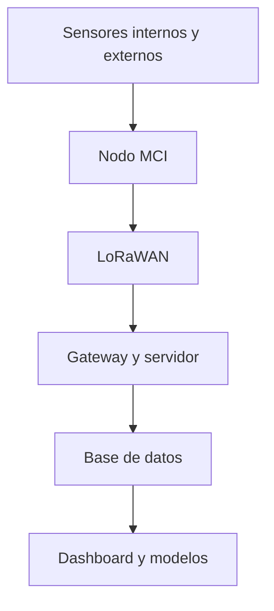

# Arquitectura MCI para monitoreo de invernaderos

## Propósito

Diseñar una plataforma modular que conecte variables internas y externas del invernadero con una red LoRaWAN y una capa de análisis. La arquitectura separa adquisición, transporte, almacenamiento y visualización para que cada parte pueda probarse de forma independiente.

## Capas

1. **Adquisición:** sensores ambientales, meteorológicos y analógicos mediante RS-485/Modbus, UART, I²C y ADC.
2. **Nodo:** ESP32/Heltec, RTC y microSD para control local, sello temporal y respaldo.
3. **Transporte:** radio LoRaWAN Clase A en la banda definida para el despliegue; configuración y diagnóstico por comandos.
4. **Servidor:** gateway, ChirpStack, decodificación y entrega de datos estructurados.
5. **Aplicación:** limpieza, series temporales, dashboard y modelos predictivos.

## Resiliencia

El almacenamiento local reduce la pérdida de observaciones durante interrupciones de enlace. El diseño contempla energía autónoma, gabinete para exteriores, antena correctamente ubicada y separación entre cableado de señal y potencia.

## Evidencia relacionada

- [Codecs y pruebas LoRaWAN](../sensores-iot/README.md)
- [Pipeline de preparación](../analisis-de-datos/pipeline-invernaderos/README.md)
- [Dashboard de invernaderos](../analisis-de-datos/dashboard-invernaderos/README.md)
- [Predicción de temperatura](../machine-learning/prediccion-temperatura/README.md)

El diagrama es una vista pública simplificada; no contiene direcciones, credenciales, topología corporativa ni planos de montaje.

[Volver a investigación técnica](README.md)
