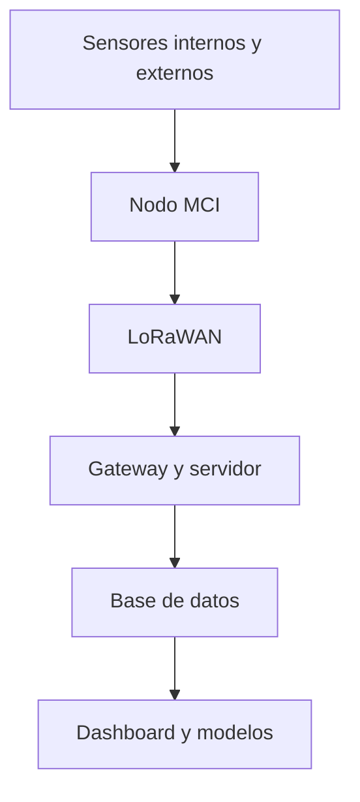

# Arquitectura MCI para monitoreo de invernaderos

El proyecto MCI conecta sensores internos y externos del invernadero con una red LoRaWAN y una capa de análisis.

## Componentes

1. **Sensores:** variables ambientales, meteorológicas y analógicas mediante RS-485/Modbus, UART, I²C y ADC.
2. **Nodo:** ESP32/Heltec, RTC y microSD para lectura, control y almacenamiento local.
3. **Comunicación:** LoRaWAN Clase A para enviar la información hacia el gateway.
4. **Servidor:** ChirpStack y decodificación de los payloads.
5. **Aplicación:** limpieza, visualización y modelos de análisis.

El almacenamiento local permite conservar mediciones cuando se pierde temporalmente la comunicación. El diseño también contempla alimentación autónoma, gabinete para exteriores y montaje de antena.

Proyectos relacionados:

- [Codecs LoRaWAN](../sensores-iot/README.md)
- [Pipeline de datos](../analisis-de-datos/pipeline-invernaderos/README.md)
- [Dashboard](../analisis-de-datos/dashboard-invernaderos/README.md)
- [Predicción de temperatura](../machine-learning/prediccion-temperatura/README.md)

El diagrama es una versión simplificada y no incluye información interna de infraestructura.

[Volver a investigación técnica](README.md)
